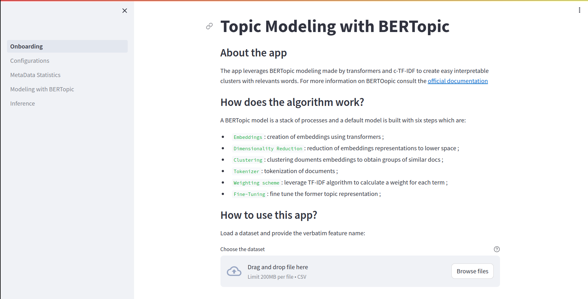

<h1 align="center">
  Topic Modeling with BERTopic
</br>
</h1>


<p align="center">
  
</br>
  
  <a href="https://www.python.org/downloads/release/python-3100/" target="_blank">
    
  </a>
  
</br>
  
  
</p>


## ToDo

- Write Unit Tests ...


## Project Description

The project combines the power of [BERTopic](https://maartengr.github.io/BERTopic/index.html) and 
[Streamlit](https://streamlit.io/) to deliver an interface performing an end-to-end topic modeling.
Instructions and more details are provided in the app ...



## Getting Started

- Through Docker Image: the image relies on a RAPIDS - Open GPU Data Science image
consequently a GPU hardware is suitable for running. Visit the following link to install the 
[nvidia-container-toolkit](https://docs.nvidia.com/datacenter/cloud-native/container-toolkit/latest/install-guide.html)

```bash
docker pull kidrissa/bertopicapp:latest
```

```bash
docker run --gpus all -p 8501:8501 -d kidrissa/bertopicapp:latest 
```

- Through Repo cloning (to be performed preferable on a Linux-based OS):
```bash
git clone https://github.com/konkinit/topic_modeling.git
```

```bash
cd topic_modeling/
```

```bash
bash package_installing.sh
```

```bash
streamlit run ./src/frontend/Onboarding.py
```


## Continious Integration

One continous integration (CI) procedure with 2 jobs mainly is crafted and launched at 
every push to the main branch:

- Pytest collects the test from the tests folder and executes them
- if Testing passes, a Docker Image is built and pushed onto the docker hub

## Citation

```bib
@article{grootendorst2022bertopic,
  title={BERTopic: Neural topic modeling with a class-based TF-IDF procedure},
  author={Grootendorst, Maarten},
  journal={arXiv preprint arXiv:2203.05794},
  year={2022}
}
```
